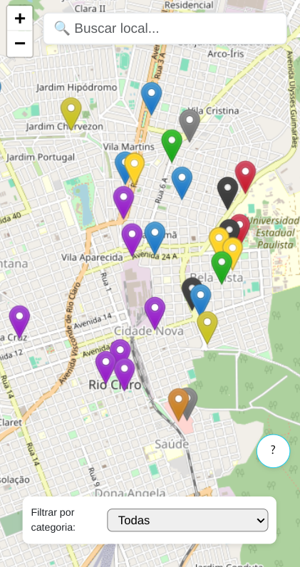

# Unesp Map Project

  

This project is a web application that provides an interactive map for locating various points of interest within the Unesp campus. It is built using React, TypeScript, and Vite, ensuring a fast and efficient development experience.

## Features

- Interactive map with location markers
- Filter locations based on categories
- Popup details for each location
- Responsive design

## Technologies Used

- **React**: A JavaScript library for building user interfaces
- **TypeScript**: A typed superset of JavaScript that compiles to plain JavaScript
- **Vite**: A build tool that provides a fast development environment
- **ESLint**: A tool for identifying and fixing problems in JavaScript code

## Live Project

You can view the live project at [Unesp Map](https://unesprc-map.vercel.app/).
